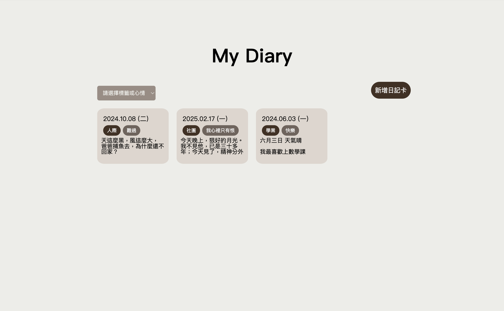
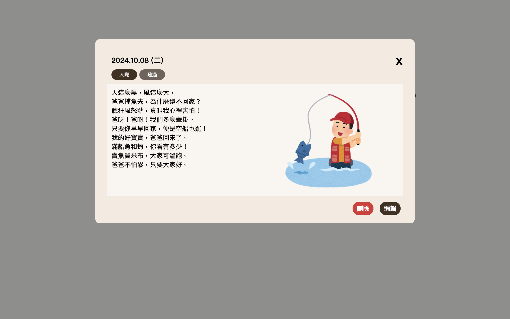
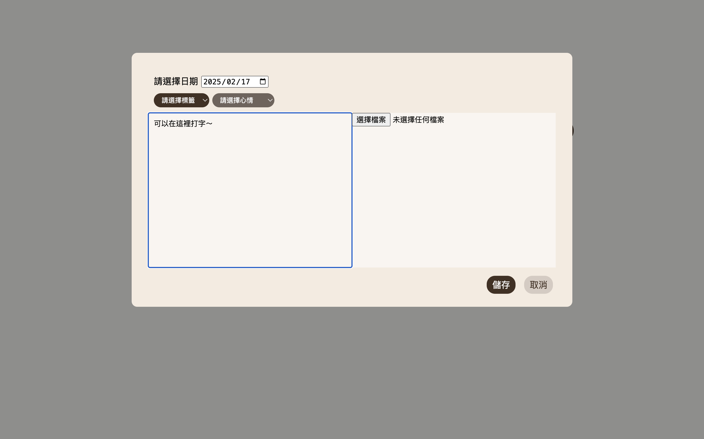
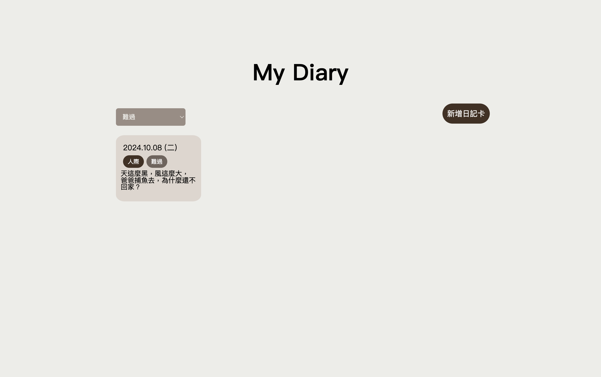

# My Diary
## Introduction
A simple diary page. Write a diary and select a date, tag, mood for it! You can also upload an image along with the diary. On the homepage, you can examine diaries with certain tag or mood by selecting a filter.

## Demo
### Home Page


### More Info about Diary
Click on the diary to view the full contents.


### Write A Diary
Click the button on the upper right corner to create a new diary.


### Filtering
Select a tag/mood with the filter on the upper left corner.


## Technique Details
I use MongoDB as the database to store diary contents and images. Images are stored by its data url.

## How to Run
### Backend
1. Setting up
```
cd backend
yarn
```
2. Create a file `.env` in the `backend` directory, and adding the following line into `.env`
```
MONGO_URL=<your mongoDB url>
PORT=8000
```
3. Run the server
```
yarn start
```

### Frontend
* Setting up
```
cd frontend
yarn
```
* Open the `index.html`
